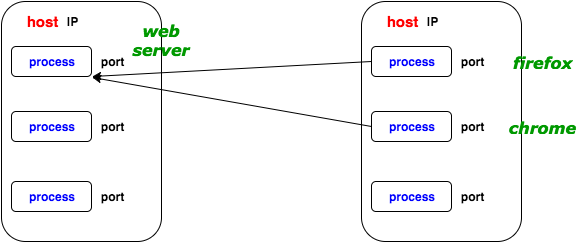

# Attention - commands not suitable for Linux! (yet)

---

```python
>>> import requests
>>> r = requests.get('http://api.fixer.io/latest')
```

???

Motivation:
- "If you have worked with client or server applications, you know how to send or receive data from the internet in a high-level language. And you know that your laptop receives the data on the Wi-Fi adapter. But how does the data get from the Wi-Fi adapter to your Python application?"

Teaching Notes:
- A json API like 'http://api.fixer.io/latest' is best for demonstration b/c the response is easy to play around with: `r.json`, `r.headers`.
- Demonstrate by live-coding from python interpreter.

More Motivation:
- "Why is this important? In an ideal world, being at a level of abstraction will allow you to do your job well without ever thinking about the levels underneath. However, in our world, abstractions are leaky, and you'll need to rely on your knowledge of the lower levels for debugging and coding."
- Next slide will have some examples of leaky abstractions from your daily stackoverflow search.

Globals:
- I use 'Unix' throughout to refer to \*nix operating systems (Linux, BSD, OSX, embedded systems, etc).

---

- http
- tcp
- port
- socket
- POSIX

**And even more things:**
- (g)libc
- kernel
- file descriptors
- I/O
- Unix vs Linux

???

=> FIXME I/O refers to: stdout/stdin/stderr, filesystem I/O (these are the things I've been asked and couldn't answer)

Explanation:
- Things we half-understand on stackoverflow <= FIXME
- "I promise you that you'll know what all of this is in one hour"

Teaching Notes:
- The "even more things" comes from people beta-testing this workshop. Here especially it seems that one person's trivial (IP) or unimportant (Unix vs Linux) is another person's mysterious and fascinating - don't discount any of these things!
- This slide will repeat at the end of the workshop ("Do you now understand these things?"). At this time I also collect further things along the same lines, and explain those that are relevant to the topic.
- Put different things on this slide depending on the crowd. You want to provide them with a service of finally understanding something elusive. Eg. for a more low-level crowd, use:
* socket
* port
* POSIX
* (g)libc
* kernel

And even more things:
* file descriptors
* I/O
* Unix vs Linux

=> FIXME make bonus slides for some of the "even more things" (such as Unix vs Linux) that come up often. They don't have much to do with the actual topic, but it's nice to tie some loose ends in a visually appealing manner.

---

background-image: url(images/Linux_kernel_System_Call_Interface_and_glibc.svg.png)

<= FIXME replace GNU C with C Standard Library in the image

???

Teaching notes:
- Motivation for this slide: "How does one write to file or use the keyboard or talk to the network card?" - "Kernel API?" - "What is the kernel API?" - At which point you can introduce the C Standard Library as one option for a "kernel API".
=> FIXME IFFs
=> FIXME potentially: why knowing C

Explanations:
- One communicates with the kernel via system calls. <= FIXME find out more
=> FIXME system command (see man ) vs syscalls
=> FIXME system calls (htop as an example): SIGKILL, SIGHUP, etc

C Standard Library:
- Many apps won't communicate with the kernel directly. Instead, they will use low-level libraries that their programming language provides.
- On the image is one such library, the C Standard Library. It is used not only by C applications, but also by Python applications, and applications in other programming languages.
- It has some problems (it's big, complex, and buggy), so sometimes you will see people advertising for their (low-level) programming language with the reason that it doesn't use `libc` or `glibc`.
- If you have ever had to compile something from source (maybe when installing something with `brew`) and seen a mention of `libc` or `glibc`, that's the C Standard Library.
- There is a specification for what the C Standard Library should contain (POSIX), and many *implementations* of the C Standard Library. `GNU C Library` (on Linux) being one, and `BSD libc` (on OSX) being another.
- There are many more alternative implementations, eg. for embedded devices, or just lightweight or less complex in general.
- You will also hear about OSs that they're "mostly POSIX-complient".

---


=> FIXME server-client example: name the hosts (1 and 2)

### Exercise #1
1. Open a web browser
2. Run the `lsof` and `netstat` commands from the cheatsheet to see what network connections the browser has
3. Look at the addresses. Do some of the numbers look familiar? What are they?

???

Diagram Explanations:
- The applications in this configuration are called clients and servers.
- "Server" is used both for a server application and a computer on which it runs, which can be confusing.
- The same computer can run multiple servers, or multiple clients, or both servers and clients. Give examples.

Teaching Notes:
- Familiar numbers will include: `80/443`, `192.168.*.*`/`10.0.*.*`, `IPv4`/`IPv6` (`tcp4`/`tcp6`)
<= FIXME read up on local IP ranges and the difference between 192.168 and 10.0 range (the latter is larger?)

Post-Exercise 1:
- "So, what did we just do? You're all familiar with `ps` (run `ps`, talk about what information it shows), and `lsof` is the same concept, but for files."
- "'Wait', you say, 'why does a list of files show network connections?'"
	1. You might have heard the expression "everything is a file in Unix".
	2. Go into `/dev` as proof of file-ness of everything.
	3. The combination of IP-port that you just saw is called a 'socket'.
	4. Sockets are a concept, but are shown as files on Unix.
- "You also might have heard of `netstat`, maybe because you once followed a network security tutorial. It does the same thing as `lsof`, but has less options."
<= FIXME put ps on cheat sheet with correct flags for OSX and Linux
=> "everything is a file in Unix" mostly means it shows up in the filesystem (look up and confirm)

Post-Exercise 2:
- This is a good moment to talk about TCP.
- TCP is a network protocol. Let's talk about a different network protocol first, the IP protocol.
- An IP packet consists of a header with an IP address and a data payload. The IP packet gets us to `[point at the edge of the host on the diagram]`, at which point the data payload is unpacked revealing the TCP packet. The TCP packet is a header with a port and a data payload. It gets us to `[point at the edge of a process on the diagram]`, at which point the data is unpacked, revealing whatever the TCP packet was carrying. If it was carrying HTTP, the data contains and HTTP header (which gets parsed by the server) and some javascript/html/etc.
- Use the `requests.get()` example to show some headers.
- You might have heard about the "layer model" or "OSI layers" or "7 layers".
- TCP and IP are two of these layers. We say that TCP is "on top of" IP.
- Another protocol that might be on top of IP is UDP, which you also might have heard of.
- Below IP is the link layer, which is responsible for getting the data to ???.
=> FIXME read up on what IP and TCP packets actually carry to confirm my explanations are right
=> FIXME fix the point about the link layer

Teaching Notes:
- Draw: [ http -> tcp -> ip -> link layer ]
- Utilize whiteboard (or paper) for drawing the OSI matryoshka. Utilize the diagram on the slide to point out until which point IP and TCP will get us.

To Sum Up, We Now Know:
- This stack:
1. kernel (with pid-socket table)
2. C stdlib (sockets)
3. python socket module
4. python urllib module
5. python http module
6. python server/requests model
- \+ the same on the other side of the connection
- Draw this stack on whiteboard or paper.
=> FIXME confirm the pid-socket table

Commonly Asked Questions With Short Answers:
- These go too much in detail, so don't explain this by default, unless somebody asks.
- Q: When the data arrives at a port, how does the system know which process ID the port belongs to? A: the kernel has a port-pid table.

---

### Exercise #2

1. Run the `ifconfig` command from the cheatsheet.
2. Find your IP address on the local network. Compare with your pairing partner's IP address. What do you notice?

---

### Exercise #3
1. Run the simple server from the cheatsheet.
2. Find out your local IP with `ifconfig` and give it to your pairing partner.
3. Your pairing partner can now connect to your server with `telnet <host> <port>`.
4. Run `lsof` or `netstat`. What do you see? What are the IPs and ports?

???

Teaching Notes:
- `lsof`/`netstat` will show the IP of the pairing partner
- Clients bind to ports in the upper range. These ports don't have names (unlike `http`, `ftp`, etc), since clients don't need to be found - servers already have their details.

---

And now we're making the same server, but directly with sockets

```python
# a simple TCP echo server in Python

import socket

# Step 1: create socket
s = socket.socket(socket.AF_INET6, socket.SOCK_STREAM)

# Step 2: set socket options
s.setsockopt(socket.SOL_SOCKET, socket.SO_REUSEADDR, 1)

# Step 3: bind to port and interface/network card
s.bind((host, port))

# Step 4: Listen for connections
s.listen(5)  # 5 is max num of pending connections in queue

# Step 5: Accept connection
clientsock, clientaddr = s.accept()

# You can now send/receive data with clientsock.sendall()
# and clientsock.recv()
```

---

# Exercise #4

1. Run the tcp socket server from command line (see cheatsheet)
2. Connect to the server using telnet (see cheatsheet)
3. What do you see?
4. Bonus: Explore the sockets that were created using tools from Exercise #1

???

Teaching Notes:
- This is the same exercise as #3, but with a different server.
- This is a bonus exercise. Including it would make the workshop go over 1 hour.

---

- http
- tcp
- port
- socket
- POSIX
- (g)libc
- kernel

???

Teaching Notes:
- Do you understand these things now?
- If some things were not yet understood, answer remaining questions.

Bonus:
- If there is time, collect more concepts that you heard a hundred times, but not quite sure what they mean, and explain them.
